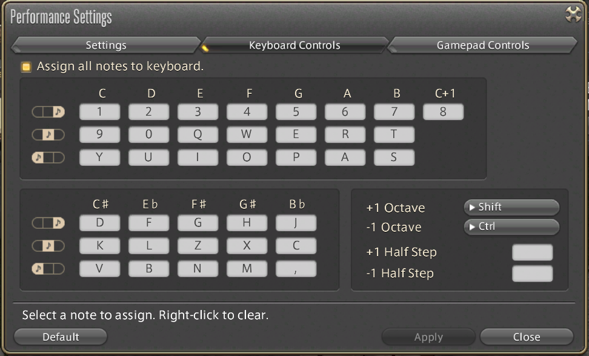
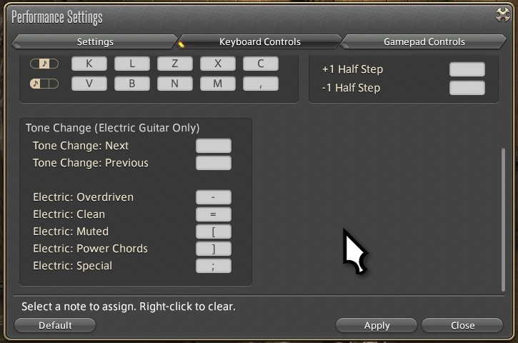

# Bard Diva

Python script that plays MIDI files in Final Fantasy XIV's Bard Performance Mode, akin to BardMusicPlayer, but for Linux (and other systems that support Python 3 and Tkinter)!

I have personally tested this on Windows 11, Fedora, !Pop_OS, Alma, Bazzite and Arch, under both X11 and Wayland. I had no luck with Ubuntu 25.04, thus far, but may try again eventually. I'd be interested in hearing about any issues with other distros in the Issues section of this repository. I believe that it works on Mac, but I'm unable to test it.

If you're on Windows, but having trouble getting Bard Music Player to work, there's a fork that skips the update check that does still work. I've been inspired to get this working again lately so that I no longer need to depend on Bard Music Player, which does not work under Linux (or Mac) anyway.

### To install dependencies:

| Debian-based distros         | Fedora                        | Arch Linux                  | Void Linux                     |
|:----------------------------:|:-----------------------------:|:---------------------------:|:------------------------------:|
| `apt-get install python3-tk` | `dnf install python3-tkinter` | `sudo pacman -S tk`         | `xbps-install python3-tkinter` |
|                              |                               | `sudo pacman -S python-pip` |                                |

| Bazzite, Kinoite, Silverblue            | Windows 10/11                       | macOS                          |
|:---------------------------------------:|:-----------------------------------:|:------------------------------:|
| `rpm-ostree install python3-tkinter`    | `winget search Python.Python`       | `brew install python3-tkinter` |
|                                         | then:                               | (requires homebrew)            |
|                                         | `winget install Python.Python.x`    | https://brew.sh/               |
|                                         | Must be version 3.10+               |                                |

`pip install -r requirements.txt`

or

`pip install --user --break-system-packages -r requirements.txt` for systems that give errors about externally managed environment nonsense (Arch does this BS, btw). You may
also have to add the path for mido to your PATH in .bashrc. I may eventually change the instructions to use pipx instead, since this externally managed nonsense is a growing
pestilence taking root within the Python community, and at some point fighting against will become the greater effort. This current fix does work, but comes with a wide array
of warnings that look slightly scary.

### Wayland users:

You must install ydotool to enable keypresses to be sent, as a workaround to Wayland's security protocols. In this case pyautogui is not used at all, and will not be imported at run time. Windows, Mac and X11 users will still be importing and using pyautogui instead, and can skip this section.

#### Bazzite/Kinoite/Silverblue:

Bazzite comes with ydotool preinstalled. Not sure about the other two here.

- First we'll need to copy the ydotool.service file to another location, where it can be edited:
`cp /usr/lib/systemd/system/ydotool.service ~/.config/systemd/user/ydotool_home.service`

- You may have to create the ~/.config/systemd/user/ directory first, if this is your first user service.

- Run the following command to get your UID and GID:
`echo $(id -u):$(id -g)`

- Edit the ~/.config/systemd/user/ydotool_home.service file to add the following to the ExecStart line:
`--socket-own=UID:GID --socket-path=/home/username/.ydotool_socket`

- Mine looks like `--socket-own=1000:1000` because my UID is 1000 and my GID is 1000:
`ExecStart=/usr/bin/ydotoold --socket-own=1000:1000 --socket-path=/home/myusername/.ydotool_socket`

(The UID and GID came from the previous command, and replace "username" with your own user name in the path, as we MUST store the socket in the user's home directory on Bazzite)

- You'll need to have the systemd user service running to setup the virtual input device:
`systemctl --user enable ydotool_home.service` 

- Add the following line to your ~/.bashrc file:
`export YDOTOOL_SOCKET="$HOME/.ydotool_socket"`

- close any open terminal windows after adding this line, and then re-open before continuing

- Start the service:
`systemctl --user start ydotool_home.service`

- Optionally check if it started:
`systemctl --user status ydotool_home.service`

#### Debian based distros:

- Install ydotool:
`sudo apt-get install ydotool`

Note: I cannot currently make ydotool work correctly on Ubuntu 25.04, and I have stopped trying.

- Ubuntu will also need the daemon to be installed seperately:
`sudo apt-get install ydotoold`

- Ubuntu does not create a systemd .service file during installation, so copy the one provided with this project from where you cloned Bard Diva:
`sudo cp ydotoold.service /usr/lib/systemd/system/ydotool.service`

- Run the following command to get your UID and GID:
`echo $(id -u):$(id -g)`

- Edit the /usr/lib/systemd/system/ydotool.service file to add the following to the ExecStart line:
`--socket-own=UID:GID`

- Mine looks like `--socket-own=1000:1000` because my UID is 1000 and my GID is 1000:
`ExecStart=/usr/bin/ydotoold --socket-own=1000:1000`

- For Ubuntu it will have been in the file you just copied, but you'll want to edit it for your own UID and GID

- You'll need to have the systemd user service running to setup the virtual input device:
`sudo systemctl enable ydotool`

- Add the following line to your ~/.bashrc file:
`export YDOTOOL_SOCKET=/tmp/.ydotool_socket`

- close any open terminal windows after adding this line, and then re-open before continuing

- Start the service:
`sudo systemctl start ydotool`

- Optionally check if it started:
`sudo systemctl status ydotool`

- Check to see if you now own the socket tmp file:
`ls -l /tmp/.ydotool_socket`

- If so, it should be ready to use now!

- On Ubuntu you may have to change the owner of the socket manually after EVERY reboot:
`sudo chown 1000:1000 /tmp/.ydotool_socket`

- With Ubuntu 25.04 no part of this process went smoothly, I could not get pip to install the required components, nor did I actually get ydotool working, and the program was not functional.

#### Fedora/RHEL/Rocky/Alma:

- Install ydotool:
`sudo dnf install ydotool`

- Run the following command to get your UID and GID:
`echo $(id -u):$(id -g)`

- Edit the /usr/lib/systemd/system/ydotool.service file to add the following to the ExecStart line:
`--socket-own=UID:GID`

- Mine looks like `--socket-own=1000:1000` because my UID is 1000 and my GID is 1000:
`ExecStart=/usr/bin/ydotoold --socket-own=1000:1000`

- You'll need to have the systemd user service running to setup the virtual input device:
`sudo systemctl enable ydotool`

- Add the following line to your ~/.bashrc file:
`export YDOTOOL_SOCKET=/tmp/.ydotool_socket`

- close any open terminal windows after adding this line, and then re-open before continuing

- Start the service:
`sudo systemctl start ydotool`

- Optionally check if it started:
`sudo systemctl status ydotool`

- Check to see if you now own the socket tmp file:
`ls -l /tmp/.ydotool_socket`

- If so, it should be ready to use now!

#### Arch based distros:

- Install ydotool:
`sudo pacman -S ydotool`

- Run the following command to get your UID and GID:
`echo $(id -u):$(id -g)`

- Copy the ydotoold.service file to /usr/lib/systemd/system/ydotoold.service (if it doesn't exist yet):
`sudo cp ./ydotoold /usr/lib/systemd/system/`

- Edit the /usr/lib/systemd/system/ydotool.service file to add the following to the ExecStart line:
`--socket-own=UID:GID`

- Mine looks like `--socket-own=1000:1000` because my UID is 1000 and my GID is 1000:
`ExecStart=/usr/bin/ydotoold --socket-own=1000:1000`

- You'll need to have the systemd user service running to setup the virtual input device:
`sudo systemctl enable ydotoold`

- Add the following line to your ~/.bashrc file:
`export YDOTOOL_SOCKET=/tmp/.ydotool_socket`

- close any open terminal windows after adding this line, and then re-open before continuing

- Start the service:
`sudo systemctl start ydotoold`

- Optionally check if it started:
`sudo systemctl status ydotoold`

- Check to see if you now own the socket tmp file:
`ls -l /tmp/.ydotool_socket`

#### Void Linux:

I have no experience with Void Linux, and my exeperience with other distros involves systemd, so I'll muddle through here, as best I can.

I found this for getting ydotool installed:

git clone  https://github.com/ReimuNotMoe/ydotool  
cd ydotool  
mkdir build && cd build  
cmake -DSYSTEMD_USER_SERVICE=OFF -DSYSTEMD_SYSTEM_SERVICE=ON ..  
make -j \`nproc\`  
sudo cp ydotool /usr/local/bin  
sudo cp ydotoold /usr/local/bin  
sudo chmod +s $(which ydotool)  
sudo mkdir -p /etc/sv/ydotoold  
sudo cat << EOF | sudo tee /etc/sv/ydotoold/run  
#!/bin/sh  
/usr/local/bin/ydotoold  
EOF  
sudo chmod +x /etc/sv/ydotoold/run  
sudo ln -sf /etc/sv/ydotoold /var/service/  
sudo sv up ydotoold  

Modifying the creation of the service script in a fashion similar to other distros, by adding the socket argument, might work similarly to systemd based systems, but I'm 
unable to test or verify that. It's more of a place to start, since I have never used Void. If anybody has this working on Void, open an issue or message me, and I'll update it.

### Before running:

Ensure keybindings are set as per the following:

### Running:

- Open up Bard Performance Mode in FFXIV with instrument of choice

- Run `python play.py` or `./play.py` and select the files in the GUI. If you get errors about pyautogui, try using the Wayland instructions instead (above and below), which in theory should work on all Linux systems.

- On Wayland run `python play.py wayland` or `./play.py wayland` instead

- Switch back to FFXIV, and rock out. The song will start playing after the user selectable delay timer.

### New features:

- Play all channels or just play a single channel, which is good for songs that work better with one or the other

- Selectable delay time in GUI

- Lists all channels and instruments assigned, including tone switches (works for MIDI files that have a properly encoded program_change to identify the instrument for each channel, and for files that are encoded for tone switching for Bard Music Player)

- GUI implemented in Tkinter instead of PySimpleGUI to fix license headaches

- Guitar "tone switching" like Bard Music Player

- Song progress bar

- Ability to hold long notes (highly experimental right now)

- Ability to select an octave range target

- Song looping

- Wayland support!

### Planned features:

- Ability to pause songs

- Ability to selectively enable or disable any channel

- Network synchronization for multi-box performance (using zeroconf, perhaps)

- Visual song analyzer, to display distribution of notes across each octave from 0 to 8

### Some notes for Windows 10/11 and macOS:

- Windows requires the App Installer application from the Windows Store, which is usually installed by default, but on rare occassions is not installed, in order to use winget from the command line. After searching for Python.Python, you must install the precise listed version that you want to use according to it's ID. This program requires Python 3.10 or newer (3.12 is the latest right now).

- macOS command line example above requires Homebrew

- I'm hoping to start testing this on Mac relatively soon, as I prepare to shift over to that platform. Any additional instructions required will be added then.
